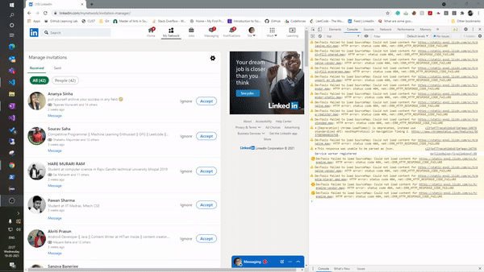

# LinkedinConnectionRequestHandler
A chrome extension built in HTML,CSS and JS to automate accepting or ignoring a connection request on linkedin

## Video demo



## Getting started

**To get started, follow the instructions below**

To get a local copy up and running follow these simple steps.

- git clone the repo

```
git clone https://github.com/AnkitKumarGiri/LinkedinConnectionRequestHandler.git && cd LinkedinConnectionRequestHandler
```

To install in Chrome

- Head over to chrome://extensions
- Toggle "Developer mode" on.
- Click Load unpacked.
- Upload the dist folder to chrome
- The extension should now be available for use 

How to use extension

- Head over to https://www.linkedin.com/mynetwork/invitation-manager/
- Enter the minimum number of mutual connections to accept a request
- Select checkbox to ignore requests which do not pass the filter
- Click on "Handle requests"
